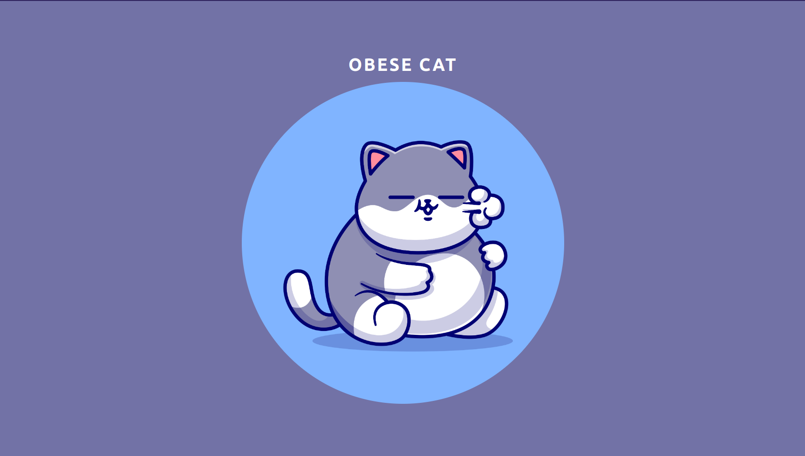

# OBESE CAT - an opinionated CREATE REACT APP with typescript redux toolkit tailwind & more



<br>

## Why
 Setting up a React app and running is a time consuming task & making decision with React is even harder, what folder structure to go for ? which library to use for routing? which one for writing css? these are hard questions i faced when working with React. over the time i gained bit of knowledge from my work so I created this template which takes all the hard decisions for you on your behalf. Feel free to tweak these template according to your needs.

## Inspirations
 folder structure : [Colocation](https://kentcdodds.com/blog/colocation) blog post by Kent C. Dodds

## Features

- ⚡️ [React 18](https://beta.reactjs.org/)
- 🦾 [TypeScript](), of course
- 🧹 [Eslint]() with famouse airbnb styles
- 🐶 [Husky](https://typicode.github.io/husky/#/) - Modern native git hooks made easy
- 🎨 [Tailwind with JIT](https://tailwindcss.com/) - next generation utility-first CSS
- 🗂 [Absolute imports]() - make the component more readable and clean


```
## Getting Started

[Generate](https://github.com/sdf/generate) a new project
from this template, clone it, install project dependencies, update the
environment variables found in [`env.development`](./env/), and start hacking:

```
$ git clone https://github.com/
$ cd ./example
$ npm i
$ npm run dev
```

## Scripts

- `npm run dev` — Launches the app in development mode on [`http://localhost:3000`](http://localhost:3000/)
- `npm run build` — Compiles and bundles the app for deployment
- `npm run lint` — Validate the code using ESLint
- `npm run lint:fix` — Validate the code using ESLint and autofix code
- `npm run test` — Run unit tests with Jest